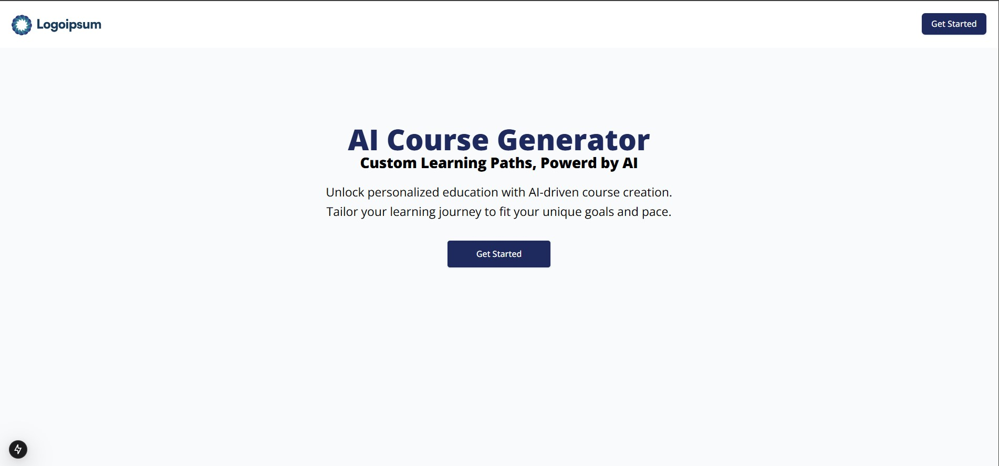
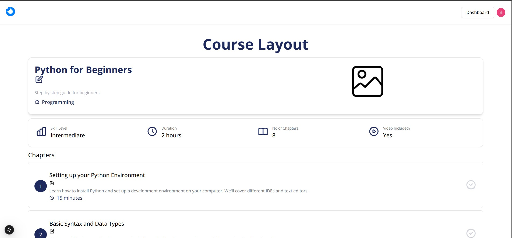
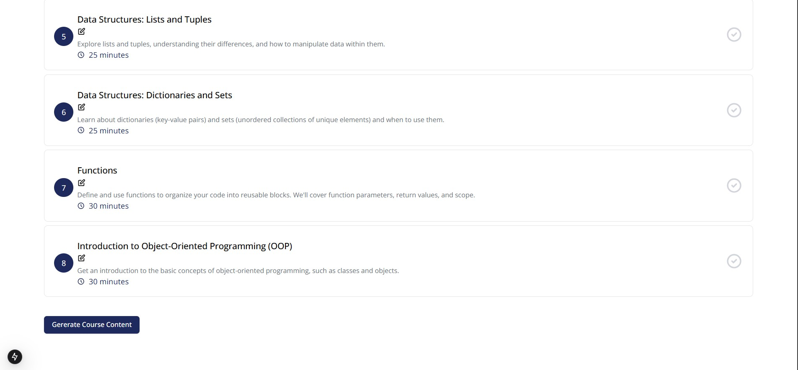
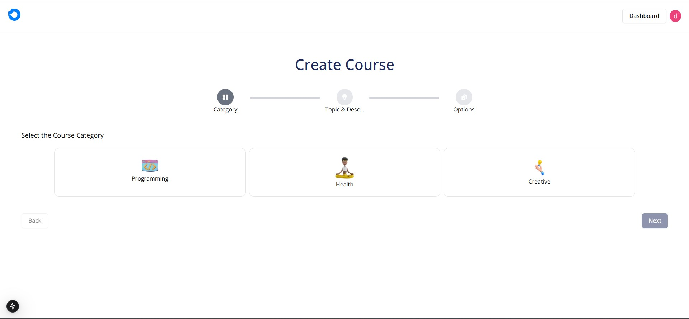
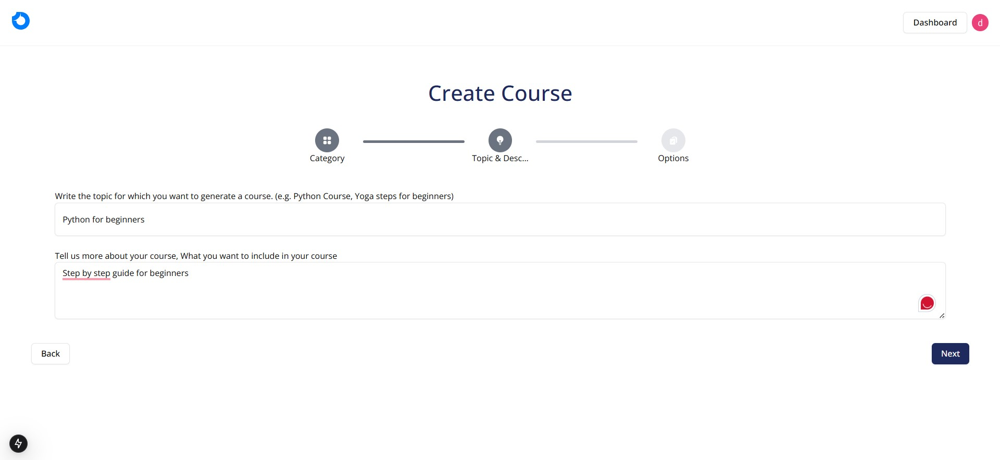
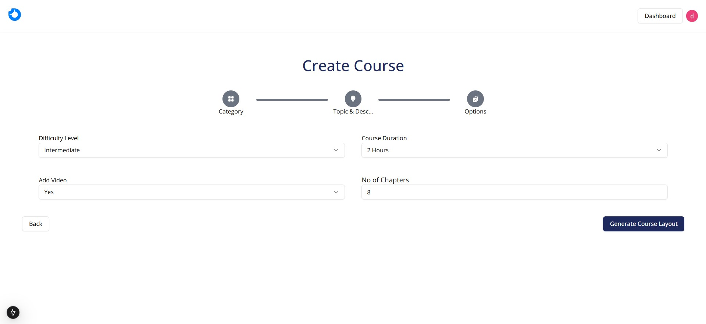
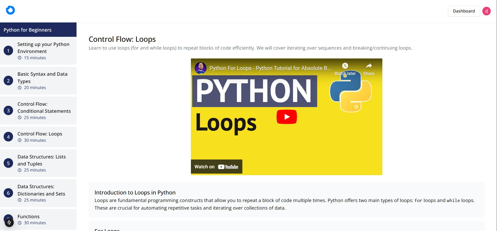
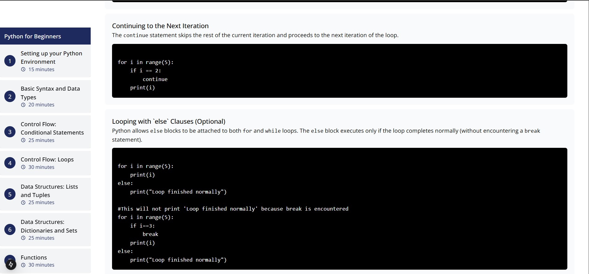

# AI Course Generator

The **AI Course Generator** is an advanced web-based application designed to automate the creation of educational content using Artificial Intelligence. It leverages state-of-the-art technologies such as Next.js, Google Generative AI, Firebase, and Drizzle ORM to provide a seamless course creation experience.

## Features

### 1. AI-Powered Course Layout Creation

- Automatically generates course outlines based on user input.
- Utilizes **Google Generative AI** for tailored content creation.
- Outputs structured JSON with course details like chapter names, descriptions, and durations.

**Screenshot:**  


### 2. Dynamic Chapter Content Generation

- Produces detailed chapter content, including objectives and practical examples.
- Supports a variety of educational topics and difficulty levels.

**Screenshot:**  



### 3. Cloud Integration with Firebase

- Secure user authentication and storage.
- Scalable and reliable for handling large datasets.

**Screenshot:**  




### 4. Database Management with Drizzle ORM

- Efficiently stores course layouts and chapter data.
- Uses PostgreSQL-compatible schemas for scalability.

**Screenshot:**  



---

## How It Works

### Step 1: User Input

Users provide course parameters:

- **Category** (e.g., Programming, Yoga)
- **Topic** (e.g., Python Basics)
- **Difficulty Level** (Basic, Intermediate, Advanced)
- **Duration** and **Number of Chapters**

### Step 2: AI-Powered Processing

- Input is processed using Google Generative AI.
- A detailed course layout is generated in JSON format.

### Step 3: Secure Database Storage

- Data is securely stored using Drizzle ORM in a PostgreSQL-compatible Neon database.

### Step 4: User-Friendly Output

- The generated course is displayed on a responsive dashboard for review and customization.

---

## Technologies Used

### Frontend

- **Next.js**: Provides server-side rendering and a fast, responsive UI.
- **Tailwind CSS**: Ensures modern and customizable design.

### Backend

- **Google Generative AI**: Powers the AI-driven course and content generation.
- **Drizzle ORM**: Handles database operations with efficiency and scalability.

### Database

- **Neon (PostgreSQL)**: Stores course layouts and user data securely.

### Cloud Integration

- **Firebase**: Manages authentication and file storage.

---

## Getting Started

### Prerequisites

- Node.js and npm installed
- A Firebase project set up with API credentials
- Access to Google Generative AI API

### Installation

1. Clone the repository:
   ```bash
   git clone https://github.com/lvimuth/ai-course-generator.git
   ```
2. Navigate to the project directory:
   ```bash
   cd ai-course-generator
   ```
3. Install dependencies:
   ```bash
   npm install
   ```

### Configuration

1. Create a `.env` file in the root directory and add the following:
   ```
   NEXT_PUBLIC_GEMINI_API_KEY=your-google-ai-api-key
   NEXT_PUBLIC_FIREBASE_API_KEY=your-firebase-api-key
   NEXT_PUBLIC_DB_CONNECTION_STRING=your-database-connection-string
   ```

### Run the Application

- Start the development server:
  ```bash
  npm run dev
  ```
- Open `http://localhost:3000` in your browser.

---

## Usage

1. Log in using your credentials.
2. Input course parameters such as category, topic, and difficulty level.
3. Generate course layouts and chapters.
4. Review and customize the output on the dashboard.
5. Share your course links or export the content.

---

## Contribution

Contributions are welcome! Feel free to fork the repository and submit pull requests for enhancements or bug fixes.

---

## License

This project is licensed under the MIT License.

---

## Contact

For queries or support, please contact [lakshithavimuth8@gmail.com] or visit our GitHub repository.
